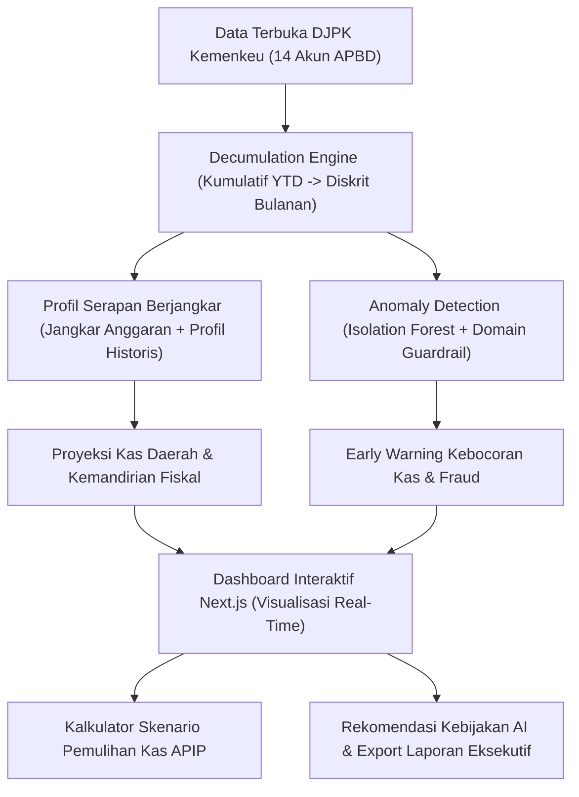

# PANDUAN LENGKAP PRESENTASI & STRATEGI DEWAN JURI BANK INDONESIA
**PIDI BI DIGDAYA x HACKATHON 2026**  
**Proyek:** RevDadas – Deteksi Anomali & Kecerdasan Fiskal untuk Bapenda  
**Tim:** Team BITGrow (*Kwik Andreas Jonathan, Gwyneth Eunice Widjaja, Clay Micholaz Fu, Moses Chisthoper Adisam*)  
**Live Demo:** [revdadas.vercel.app](https://revdadas.vercel.app)

---

# BAGIAN 1: Mengapa Nilai Pemulihan Sempat Bernilai Rp 0?

### 1. Rumus di Balik Kalkulator
Di dalam kode (`frontend/src/components/dashboard/ImpactCalculator.tsx` & `page.tsx`), perhitungannya adalah:

$$\text{Potensi Nilai Pemulihan} = \text{Potential Loss (Nilai Deviasi Anomali)} \times \left(\frac{\text{\% Asumsi Skenario Anda}}{100}\right)$$

### 2. Penyebab Utama: Filter Default Temporal & Geografis
Saat dashboard pertama kali dimuat, sistem menerapkan pengaturan default:
- **Tahun Analisis:** Diatur ke tahun terbaru di dataset, yaitu **2025** (`selectedYear: 2025`).
- **Provinsi Terpilih:** Diatur ke 3 provinsi default awal: **DKI Jakarta, Jawa Barat, dan Jawa Timur**.
- **Jenis Pajak:** **Semua Pendapatan** (sistem otomatis mengabaikan akun belanja dan agregat ganda).

### 3. Fakta Data Hasil Deteksi AI
Model *Isolation Forest* yang dilengkapi dengan *Domain Rule Guardrail* (menghapus anomali semu pada pos pencairan bertahap/lumpy seperti hibah & belanja modal) hanya meloloskan anomali murni di seluruh Indonesia:
- **2023:** Jawa Barat (Pajak Daerah)
- **2024:** Jawa Barat (Pajak Daerah)
- **2024:** Jawa Timur (Retribusi Daerah)
- **2024:** Bali (Retribusi Daerah)
- **2025:** Sumatera Utara (Retribusi Daerah)

> [!IMPORTANT]
> **Akar Masalah:**  
> Pada **Tahun 2025**, untuk provinsi **DKI Jakarta, Jawa Barat, dan Jawa Timur**, **TIDAK ADA ANOMALI SAMA SEKALI ($n = 0$)**.  
> Karena jumlah anomali $= 0$, maka $\text{Potential Loss} = \text{Rp } 0$.  
> Berapapun persentase slider yang digeser (5%, 10%, atau 50%):  
> $$\text{Rp } 0 \times 5\% = \mathbf{Rp\ 0}$$

### 4. Cara Menampilkan Angkanya Saat Demo di Hadapan Juri
Lakukan salah satu dari dua langkah berikut di dashboard:
- **Opsi A (Ganti Tahun ke 2024):** Ubah filter tahun dari `2025` ke `2024`. Seketika pada 3 provinsi tersebut terdeteksi anomali sebesar **Rp 7,20 Triliun** (Jawa Barat & Jawa Timur), dan nilai pemulihan pada 5% langsung melonjak menjadi **Rp 360,15 Miliar**!
- **Opsi B (Pilih Sumatera Utara pada Tahun 2025):** Jika tetap di tahun 2025, centang **Sumatera Utara**. Terdeteksi anomali Retribusi Daerah sebesar Rp 118,9 Miliar, dan kalkulator langsung menghitung nilai pemulihan sebesar **Rp 5,95 Miliar**.

### 5. Cara Menjawab Juri Jika Hal Ini Ditanyakan
> *"Bapak/Ibu Dewan Juri, nilai Rp 0 pada skenario default 2025 justru menunjukkan **akurasi dan integritas model AI RevDadas**. Sistem kami tidak mengada-ada atau memaksakan fraud di daerah yang pelaporannya bersih dan konsisten. Pada tahun 2025 di DKI, Jabar, dan Jatim, realisasi berjalan sesuai koridor tren historis. Namun, begitu kita audit data tahun 2024 atau beralih ke provinsi yang memiliki spike deviasi seperti Sumatera Utara, sistem langsung mengisolasi anomali dan menghitung potensi pengamanan kas daerah secara presisi."*

### 6. Catatan Pembaruan Terkini (Integrasi 38 Provinsi)
Setelah seluruh hasil scraping **38 provinsi se-Indonesia** (`scraped/_konsolidasi.csv`) diintegrasikan:
- Tampilan default tahun 2025 kini otomatis mendeteksi **10 record anomali** pada wilayah default (DKI Jakarta, Bengkulu, Gorontalo, Maluku).
- *Potential Loss* tercatat sebesar **Rp 4,47 Triliun**.
- Asumsi Nilai Pemulihan (pada 5%) langsung bernilai **Rp 223,55 Miliar** sejak pertama kali aplikasi dibuka.

---

# BAGIAN 2: Kuasai Seluruh Sistem RevDadas untuk Dewan Juri Bank Indonesia

Bank Indonesia bukan sekadar juri teknis koding; BI memiliki mandat menjaga **Stabilitas Makroekonomi, Stabilitas Sistem Keuangan (SSK), serta Digitalisasi Ekonomi & Keuangan Daerah (ETPD/TP2DD)**. Hubungkan selalu fitur RevDadas dengan isu-isu ini.

---

## 1. Narasi Utama: Mengapa Bank Indonesia Membutuhkan RevDadas?

| Isu Strategis Bank Indonesia | Masalah di Lapangan | Solusi RevDadas |
| :--- | :--- | :--- |
| **Elektronifikasi Transaksi Pemda (ETPD)** | BI giat mendorong QRIS Pemda & KKPD, tapi Pemda tidak punya alat untuk mengevaluasi dampak lonjakan/kebocoran PAD. | RevDadas menjadi **otak analitik lanjutan** bagi TP2DD untuk memantau efektivitas PAD pasca-digitalisasi. |
| **Optimalisasi Kas & Idle Fund Daerah** | Pemda sering lambat menyerap anggaran di awal tahun dan menumpuk uang di BPD (SILPA tinggi), mengganggu peredaran likuiditas. | **Profil Serapan Berjangkar** memproyeksikan arus penerimaan 6–24 bulan ke depan, dijangkar pada pagu Anggaran APBD, sehingga bendahara daerah dapat merencanakan kas dengan presisi. |
| **Under-reporting & Kebocoran PAD** | Pendapatan sektor pajak hotel, restoran, dan retribusi rawan manipulasi pencatatan manual. | **Isolation Forest** mendeteksi indikasi *under-reporting* dan kebocoran transaksi secara otomatis sebelum diaudit BPK/APIP. |

---

## 2. Bedah Komponen Teknis (Kupas Tuntas Isi Proyek)

### A. Data Preprocessing & "Decumulation Engine" (`src/data_loader.py`)
- **Tantangan Riil:** Data resmi APBD dari Kemenkeu/DJPK berbentuk **kumulatif YTD (Year-to-Date)**. Jika langsung diramalkan, model time series biasa akan rusak karena trennya selalu naik semu dari Januari ke Desember.
- **Inovasi RevDadas:** Memiliki mesin dekumulasi otomatis yang mengurangi nilai bulan $t$ dengan bulan $t-1$ untuk menghasilkan **penerimaan riil diskrit bulanan**, serta menangani pembersihan data anomali tutup buku Desember.

### B. Mesin Forecasting: Profil Serapan Berjangkar (`src/serapan.py`)
- **Model Utama: Profil Serapan Berjangkar (Budget-Anchored Absorption Profile)**
  - *Mengapa bukan Deep Learning (LSTM/Transformer)?* Data fiskal bulanan APBD di Indonesia berhorizon pendek ($N \approx 36$ titik data). Model deep learning akan mengalami *overfitting* fatal.
  - *Mengapa bukan Prophet?* Prophet hanya mencapai akurasi 54,3% (MASE 0,97 — praktis setara tebakan sepele). Model Theta Method pun hanya ~78% karena keduanya **tidak bisa memanfaatkan pagu Anggaran** sebagai informasi eksogen.
  - **Prinsip Kerja:**
    - Menggunakan **pagu Anggaran APBD** (yang sudah diketahui sejak awal tahun fiskal) sebagai jangkar prediksi
    - Menghitung profil distribusi serapan bulanan historis (rasio realisasi/anggaran per bulan)
    - Memproyeksikan ke depan: $\text{prediksi}[\text{bulan}] = T \times p[\text{bulan}]$
    - $T = \text{Anggaran} \times \text{rasio serapan historis}$
    - $p[\text{bulan}] = \text{normalisasi}(\gamma \cdot \text{profil sendiri} + (1-\gamma) \cdot 1/12)$
  - **Parameter γ disesuaikan per rumpun akun:** Belanja (0,75 — musiman kuat), Pendapatan Inti (0,40), Pendapatan Rinci (0,15 — banyak derau, diratakan)
  - **Hasil:** Akurasi **70,1%** (WAPE 29,9%, MASE 0,79), 45× lebih cepat dari Prophet, tanpa dependensi berat
  - **Gerbang Kualitas:** Hanya seri dengan **MASE < 1** (melampaui benchmark seasonal naive) yang ditayangkan
- **Model Cadangan: Theta Method / Prophet**
  - Tersedia untuk evaluasi perbandingan. Dapat di-switch dengan `python scripts/precompute.py --engine theta`.

### C. Deteksi Anomali Berbasis Domain (`src/anomaly_detection.py`)
- Algoritma dasar menggunakan **Isolation Forest** dengan ekstraksi 4 fitur inti per seri wilayah:
  1. *Revenue Norm* (Z-Score pendapatan per kategori)
  2. *MoM Change* (% perubahan bulanan)
  3. *Ratio to MA-3* (deviasi terhadap rata-rata bergerak 3 bulan)
  4. *Seasonality Deviation* (penyimpangan terhadap pola musiman bulan yang sama)
- **Domain Guardrail (Kunci Kecerdasan AI RevDadas):**
  - Anomali pada akun belanja modal atau hibah yang cair sekali dalam setahun otomatis diberi label `Wajar (Transaksi Insidental)` sehingga auditor tidak membuang waktu memeriksa pos anggaran yang memang secara alamiah *lumpy*.
  - Fokus hanya pada pos rutin seperti Pajak Daerah dan Retribusi Daerah.

---

## 3. Metrik-Metrik Finansial Penting di Layar Dashboard

Saat demo, jelaskan kartu-kartu KPI berikut:

1. **Total Revenue (Aktual):** Realisasi pendapatan daerah tahun berjalan.
2. **Forecast 6–24 Bulan:** Proyeksi penerimaan ke depan lengkap dengan batas atas & bawah pada rentang keyakinan 95% (*Confidence Interval*).
3. **Risiko Anomali & Revenue Loss:** Persentase deviasi janggal terhadap total pendapatan dan estimasi nilai nominal yang menyimpang dari pola wajar.
4. **Indeks Kemandirian Fiskal:**
   $$\text{Kemandirian Fiskal} = \frac{\text{Pendapatan Asli Daerah (PAD)}}{\text{Total Pendapatan Daerah}} \times 100\%$$
   *Indikator favorit Bank Indonesia untuk mengukur seberapa mandiri suatu daerah tanpa ketergantungan transfer pusat (TKDD).*
5. **Kalkulator Skenario Audit (Impact Calculator):**
   Simulasi penyelamatan arus kas jika APIP/Inspektorat Daerah menindaklanjuti rekomendasi AI sebesar $X\%$.

---

## 4. Alur Presentasi 5 Menit yang Disarankan (Winning Pitch Flow)

1. **Menit 0:00 – 1:00 (Hook & Masalah Fiskal)**
   - Buka dengan masalah: *"Banyak Pemda kesulitan mengoptimalkan PAD dan memprediksi arus kas secara akurat, padahal Bank Indonesia sedang gencar memperluas ETPD dan digitalisasi pembayaran daerah."*
   - Kenalkan RevDadas sebagai *AI-driven Fiscal Intelligence System*.

2. **Menit 1:00 – 2:30 (Live Demo Dashboard & Peta Spasial)**
   - Tunjukkan **Heatmap Geospatial Indonesia:** Sorot daerah berstatus Optimal (hijau), Moderat (kuning), dan Kritis (merah).
   - Tunjukkan **Kemandirian Fiskal:** Jelaskan bagaimana proporsi PAD vs TKDD dianalisis secara otomatis.

3. **Menit 2:30 – 3:45 (Forecasting & Anomaly Detection)**
   - Buka grafik **Historical vs Forecast:** Jelaskan keunggulan *Profil Serapan Berjangkar* yang memanfaatkan pagu Anggaran APBD dan profil serapan historis untuk proyeksi stabil.
   - Pindahkan filter ke **Tahun 2024** atau tampilkan **Kalkulator Skenario Audit:**
     *"Ketika terdeteksi deviasi Rp 7,2 Triliun pada 2024, slider simulasi ini langsung menunjukkan bahwa intervensi audit 5% saja dapat menyelamatkan likuiditas kas daerah sebesar Rp 360 Miliar."*

4. **Menit 3:45 – 4:30 (Rekomendasi Kebijakan & Actionable Report)**
   - Klik tombol **"Tinjau Rekomendasi Strategis":** Tunjukkan rekomendasi otomatis berbasis algoritma untuk sektor pajak hotel, retribusi, dan kepatuhan wajib pajak.
   - Tunjukkan fitur **Export PDF/Excel/Word** untuk laporan pimpinan eksekutif (Gubernur/Bupati/Kepala Perwakilan BI).

5. **Menit 4:30 – 5:00 (Closing: Sinergi dengan BI)**
   - *"RevDadas siap diintegrasikan dengan ekosistem TP2DD Bank Indonesia untuk mewujudkan tata kelola keuangan daerah yang transparan, akuntabel, dan mandiri secara fiskal."*

---

## 5. Antisipasi Pertanyaan Kritis Dewan Juri BI (Q&A Defense)

### T1: Kenapa tidak menggunakan Deep Learning seperti LSTM atau Transformer?
> **Jawaban:** *"Data realisasi APBD resmi dari Kemenkeu diperbarui secara bulanan, sehingga rentang data hanya sekitar 36 sampai 48 titik per seri. Model Deep Learning membutuhkan ribuan observasi agar tidak overfitting. Kami justru menemukan keunggulan di informasi yang selama ini diabaikan model time-series: **pagu Anggaran APBD**. Model Profil Serapan Berjangkar kami memanfaatkan anggaran sebagai jangkar prediksi, menghasilkan akurasi 70,1% (WAPE 29,9%, MASE 0,79) — jauh di atas Prophet (54,3%) dan bahkan Theta Method (~78%). Waktu komputasi sub-detik untuk seluruh 38 provinsi."*

### T2: Bagaimana sistem memastikan lonjakan penerimaan bukan sekadar efek musiman (misal: pembayaran THR atau panen raya)?
> **Jawaban:** *"Model ekstraksi fitur kami secara eksplisit menghitung fitur `Seasonality_Deviation` yang membandingkan realisasi bulan bersangkutan terhadap rata-rata bulan yang sama di tahun-tahun sebelumnya. Selain itu, ada aturan domain yang mengenali pola 'lumpy' dan 'first disbursement' pasca-idle, sehingga lonjakan musiman wajar tidak dilabeli sebagai fraud."*

### T3: Apa relevansi langsung RevDadas dengan tugas Bank Indonesia di daerah (KPwBI)?
> **Jawaban:** *"Kantor Perwakilan BI di seluruh Indonesia adalah co-chair dari TP2DD (Kepres No. 3/2021). Selama ini evaluasi IETPD lebih banyak berfokus pada infrastruktur transaksi (apakah sudah ada QRIS/EDC). RevDadas memberikan layer intelijen data pada sisi **outcome ekonomi**: memitigasi kebocoran pajak dan memitigasi risiko idle cash pemda yang bisa mengganggu stabilitas moneter regional."*
